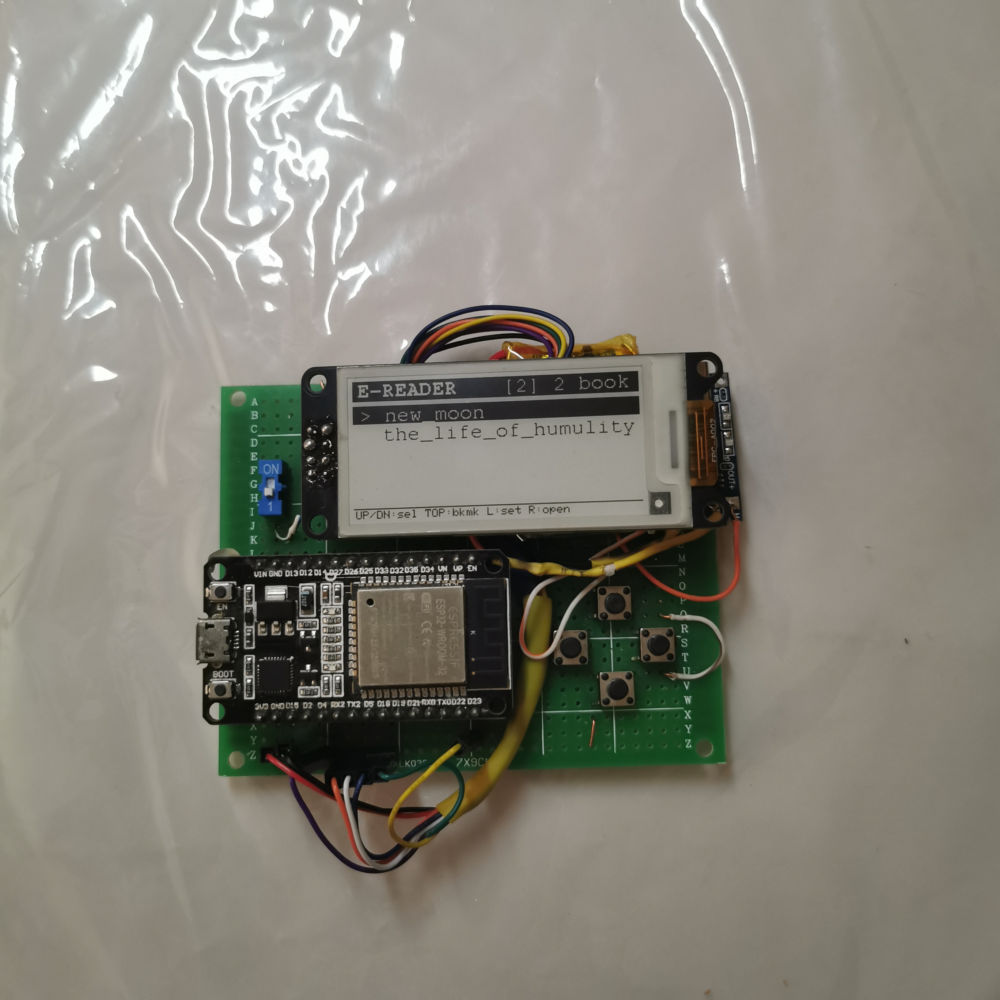
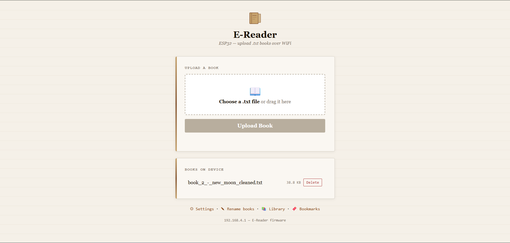
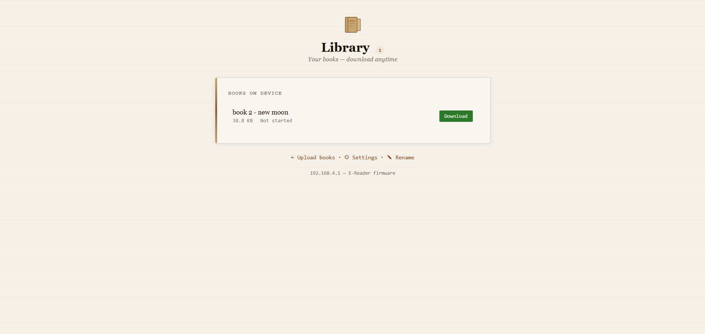
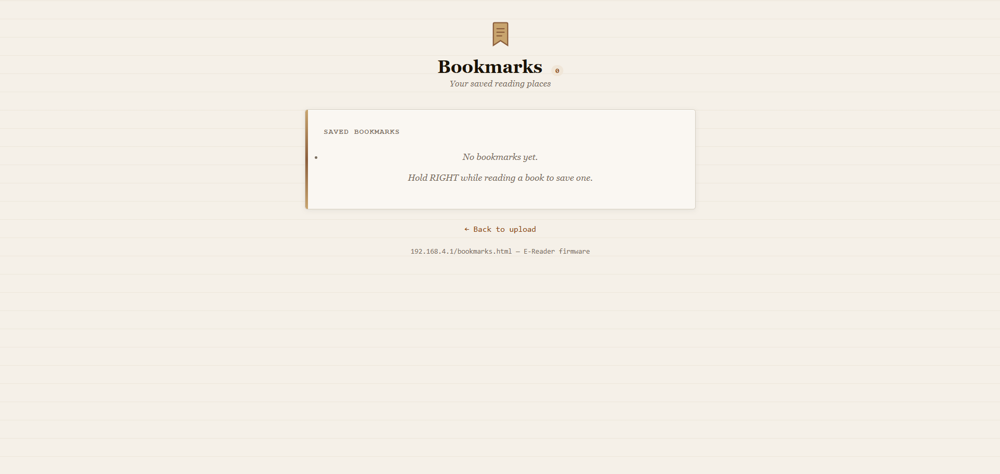
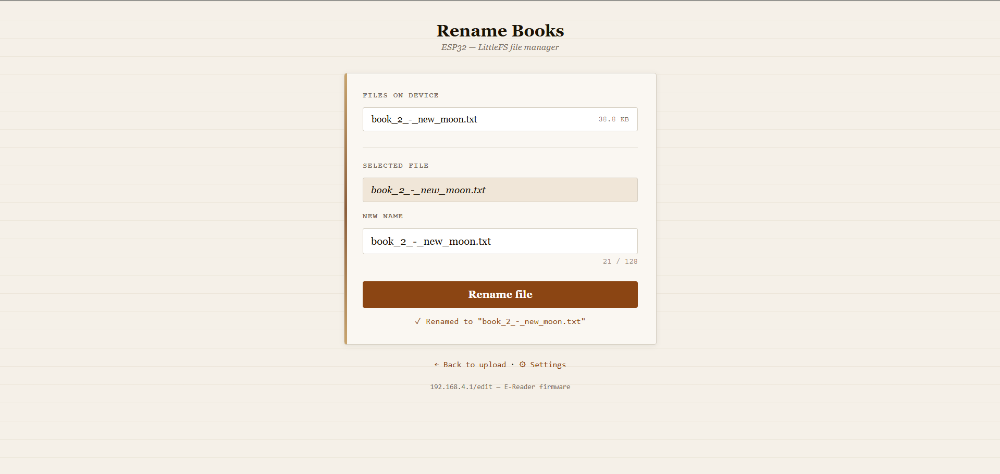

<div align="center">
  
</div>

# ESP32 E-Paper Display Reader

A portable ESP32-powered e-paper reading device with a web-based interface for transferring and reading text content. Books and system files are stored on the device's internal flash (LittleFS).

---

## Features

- ESP32-based system
- 2.13" e-paper display (SSD1680, 122x250, B/W)
- LittleFS storage for books on internal flash
- Web UI for file transfer (upload/download/delete books)
- Page navigation with physical buttons
- Bookmarks and reading progress
- Dark mode toggle (device and web)
- Battery monitoring (optional)
- Lightweight and portable
- Low power display technology
- Open-source project

---

## Gallery

### Final Device



### Web Interface






---

## Hardware Used

- **ESP32** (e.g. DevKit, C3, S3, etc.)
- **E-paper display**: 2.13" DEPG0213BN (SSD1680, 122x250, B/W)
- **Buttons**: 4 tactile switches (UP, DOWN, LEFT, RIGHT)
- **Battery module** (optional — LiPo via voltage divider on ADC)
- Jumper wires / prototype board

### Pin Connections

| Component    | GPIO | Notes                              |
| ------------ | ---- | ---------------------------------- |
| Display CS   | 5    | SPI                                |
| Display DC   | 17   |                                    |
| Display RST  | 16   |                                    |
| Display BUSY | 4    |                                    |
| Display SCK  | 18   | SPI                                |
| Display MOSI | 23   | SPI                                |
| Button UP    | 12   | INPUT_PULLUP                       |
| Button DOWN  | 13   | INPUT_PULLUP                       |
| Button LEFT  | 14   | INPUT_PULLUP                       |
| Button RIGHT | 27   | INPUT_PULLUP                       |
| Battery ADC  | 32   | Voltage divider (optional)         |

### Wiring Diagram

```
ESP32 -> E-Paper Display
-----------------------------
GPIO 5   -> CS
GPIO 17  -> DC
GPIO 16  -> RST
GPIO 4   -> BUSY
GPIO 18  -> SCK
GPIO 23  -> MOSI
GND      -> GND
3V3      -> VCC

ESP32 -> Buttons (to GND)
-----------------------------
GPIO 12  -> UP button
GPIO 13  -> DOWN button
GPIO 14  -> LEFT button
GPIO 27  -> RIGHT button
```

### Battery (Optional)

Connect a voltage divider (two 100K resistors) between battery (+) and GND, with the tap point to GPIO 32:

```
Battery (+) -> 100K -> GPIO 32 -> 100K -> GND
```

Reads 12-bit ADC, maps 2.7V-4.2V LiPo range to 0-100%. Updated every 60 seconds.

### Schematic


---

## Software Stack

- **Arduino Framework** (ESP32 Arduino Core)
- **GxEPD2** — e-paper display driver
- **ESPAsyncWebServer** — async HTTP server
- **Adafruit GFX** — font rendering
- **LittleFS** — all storage (books, settings, bookmarks, progress, web UI)
- **HTML/CSS/JavaScript** — web interface

---

## Project Structure

```bash
.
├── epaper-reader-esp32.ino    Main firmware sketch
├── data/                      Web UI files (served from LittleFS)
│   ├── index.html             Upload and manage books
│   ├── library.html           Browse books with progress
│   ├── edit.html              Rename books
│   ├── settings.html          Device settings
│   ├── bookmarks.html         View all bookmarks
│   └── bookmark.html          View single bookmark content
├── extractor_pipeline/        Book preparation utilities
│   └── pdftotextconversion/   PDF -> text extraction
├── images/                    Project photos
├── README.md
└── images/Schematic_kindle_no_sd.png   Circuit schematic
```

---

## Getting Started

### 1. Clone the Repository

```bash
git clone https://github.com/Link2004tw/esp32-epaper-display-reader.git
```

### 2. Open in Arduino IDE

Install the following libraries via Library Manager:

- **GxEPD2** (by Jean-Marc Zingg)
- **ESPAsyncWebServer** (by me-no-dev)
- **AsyncTCP** (by me-no-dev)

Select the correct ESP32 board in Arduino IDE.

### 3. Upload the Firmware

Compile and flash the sketch to the ESP32.

### 4. Upload Web UI Files

Upload the `data/` folder to LittleFS:

- Arduino IDE: Tools > ESP32 LittleFS Data Upload

### 5. Access the Web UI

Connect to the device's WiFi AP (default: **E-Reader**, password: **12345678**) and open:

```md
http://192.168.4.1
```

| Page              | Description                             |
| ----------------- | --------------------------------------- |
| `/`               | Upload and manage books (drag-and-drop) |
| `/library`        | Browse books with reading progress bars |
| `/edit`           | Rename books                            |
| `/settings`       | Dark mode toggle                        |
| `/bookmarks.html` | View all bookmarks                      |
| `/bookmark.html`  | View bookmarked page content            |

---

## Controls

### Book List Screen

- **UP**: Select previous book (at top -> bookmarks)
- **DOWN**: Select next book
- **RIGHT**: Open selected book
- **LEFT**: Open settings

### Reading Screen

- **UP**: Previous page
- **DOWN**: Next page
- **RIGHT**: Next page
- **LEFT**: Return to book list
- **Long-press RIGHT**: Save bookmark

### Bookmarks Screen

- **UP/DOWN**: Select bookmark
- **RIGHT**: Open bookmarked page
- **LEFT**: Return to book list
- **Long-press DOWN**: Delete bookmark

### Settings Screen

- **UP/DOWN**: Select setting
- **RIGHT**: Change value
- **LEFT**: Return to book list

---

## API Endpoints

| Endpoint                | Method   | Description                |
| ----------------------- | -------- | -------------------------- |
| `/list`                 | GET      | List all books as JSON     |
| `/download`             | GET      | Download a book file       |
| `/delete`               | GET      | Delete a book              |
| `/upload`               | POST     | Upload a book (multipart)  |
| `/api/rename`           | POST     | Rename a book              |
| `/api/progress`         | GET      | Get reading progress JSON  |
| `/api/bookmarks`        | GET      | List bookmarks             |
| `/api/bookmarks`        | DELETE   | Delete a bookmark          |
| `/api/bookmark/content` | GET      | Get bookmark page text     |
| `/api/settings`         | GET/POST | Get/update settings        |
| `/api/buttons`          | GET      | Get physical button states |

---

## Book Preparation Pipeline

### PDF to Text

```bash
cd extractor_pipeline/pdftotextconversion
pip install pdfminer.six
python main.py
```

### Text Cleaning

```bash
cd extractor_pipeline/removeWhiteSpace
python main.py
```

---

## Future Improvements

- EPUB support
- Better UI navigation
- Battery optimization
- Custom enclosure
- Sleep mode improvements
- Arabic / RTL text support

---

## Current Limitations

The initial SD card implementation was removed temporarily due to stability and compatibility issues.
Future revisions may reintroduce external storage with improved power handling and filesystem support.

---

## Challenges & Lessons Learned

This project helped me learn about:

- Embedded systems development
- SPI communication and bus sharing
- Web servers on ESP32
- Memory limitations
- E-paper display handling
- Hardware/software integration
- LittleFS filesystem storage

---

## License

This project is licensed under the MIT License.

See the `LICENSE` file for details.

---

## Author

GitHub: Link2004tw
