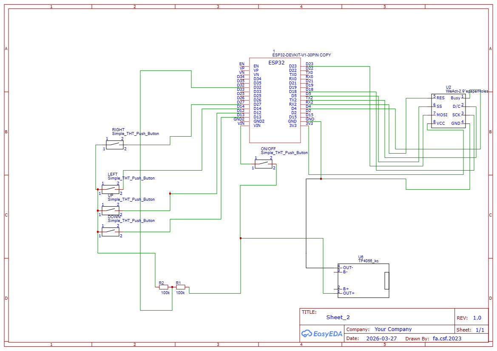

# ESP32-C3 E-Reader

A DIY e-book reader built with an ESP32 and a 2.13" e-paper display. Books are uploaded via WiFi and read on the device with pagination, bookmarks, Arabic/RTL support, and dark mode.



## Hardware

- **Board**: ESP32-C3 Super Mini
- **Display**: 2.13" DEPG0213BN e-paper (SSD1680, 122x250 pixels, B/W, landscape rotation)
- **Storage**: LittleFS (internal flash)
- **Buttons**: 4 tactile buttons (UP, DOWN, LEFT, RIGHT)
- **Battery**: Optional LiPo via voltage divider on ADC

### Pin Connections

| Component | GPIO | Notes |
|-----------|------|-------|
| Display CS | 5 | SPI |
| Display DC | 17 | |
| Display RST | 16 | |
| Display BUSY | 4 | |
| Display SCK | 18 | SPI |
| Display MOSI | 23 | SPI |
| Button UP | 12 | INPUT_PULLUP |
| Button DOWN | 13 | INPUT_PULLUP |
| Button LEFT | 14 | INPUT_PULLUP |
| Button RIGHT | 27 | INPUT_PULLUP |
| Battery ADC | 32 | Via voltage divider |

### Battery (Optional)

Connect a voltage divider (two 100K resistors) between battery (+) and GND, with the tap point to GPIO 32:
- Battery (+) -> 100K -> GPIO 32 -> 100K -> GND

Reads 12-bit ADC, maps 2.7V-4.2V LiPo range to 0-100%. Updated every 60 seconds.

```
ESP32-C3 -> E-Paper Display
---------------------------------------------
GPIO 5   -> CS
GPIO 17  -> DC
GPIO 16  -> RST
GPIO 4   -> BUSY
GPIO 18  -> SCK
GPIO 23  -> MOSI
GND      -> GND
3V3      -> VCC

ESP32-C3 -> Buttons (to GND)
---------------------------------------------
GPIO 12  -> UP button
GPIO 13  -> DOWN button
GPIO 14  -> LEFT button
GPIO 27  -> RIGHT button
```

## Features

- **Book Management**: Upload `.txt` books via WiFi web interface (drag-and-drop supported)
- **Pagination**: Navigate pages with UP/DOWN or LEFT/RIGHT buttons
- **Bookmarks**: Save bookmarks (long-press RIGHT), view on device or web
- **Reading Progress**: Auto-saves last page per book
- **Arabic / RTL**: Auto-detected per book; toggle in device settings
- **Battery Display**: Shows battery percentage in reading footer (if wired)
- **Dark Mode**: Toggle on device or via web settings
- **Responsive Web UI**: Parchment-themed HTML interface with light/dark mode

### Limits

| Limit | Value |
|-------|-------|
| Max books | 20 |
| Max bookmarks per book | 20 |
| Book name display length | 30 characters |
| Supported file format | `.txt` (UTF-8) |
| Page size | 26 chars/line x 5 lines = 130 chars |

## Web Interface

Access at `http://192.168.4.1` (default AP: **E-Reader**, password: **12345678**)

| Page | Description |
|------|-------------|
| `/` | Upload and manage books (drag-and-drop) |
| `/library` | Browse books with reading progress bars |
| `/edit` | Rename books |
| `/settings` | Dark mode, sleep timeout (UI only -- not yet implemented in firmware) |
| `/bookmarks.html` | View all bookmarks grouped by book |
| `/bookmark.html` | View text content of a specific bookmarked page |

## Controls

### Book List Screen
- **UP**: Select previous book (at top item -> bookmarks)
- **DOWN**: Select next book
- **RIGHT**: Open selected book
- **LEFT**: Open settings

### Reading Screen
- **UP**: Previous page
- **DOWN**: Next page
- **RIGHT**: Next page
- **LEFT**: Return to book list
- **Long-press RIGHT**: Save bookmark

### Bookmarks Screen
- **UP/DOWN**: Select bookmark
- **RIGHT**: Open bookmarked page
- **LEFT**: Return to book list
- **Long-press DOWN**: Delete bookmark

### Settings Screen
- **UP/DOWN**: Select setting
- **RIGHT**: Change value
- **LEFT**: Return to book list

## Building

1. Install [ESP32 board support](https://docs.espressif.com/projects/arduino-esp32/en/latest/installing.html)
2. Install libraries via Arduino IDE Library Manager:
   - GxEPD2
   - ESPAsyncWebServer
   - AsyncTCP
3. Upload sketch to ESP32
4. Upload `data/` folder to LittleFS:
   - Using Arduino IDE: Tools > ESP32 LittleFS Data Upload
   - Or via command line: `python mklittlefs.py -p 2264 0x1000 .data /tmp/littlefs.bin`
   - ESP32 uploads at: `http://192.168.4.1/littlefs`

## Book Preparation Pipeline

The `extractor_pipeline/` directory contains Python scripts for preparing books before uploading them to the device.

### PDF to Text

Converts PDF books to plain text using `pdfminer.six`:

```bash
cd extractor_pipeline/pdftotextconversion
pip install pdfminer.six
python main.py
```

Edit the `book_name` variable in `main.py` to match your PDF filename.

### Text Cleaning

Strips HTML tags, collapses whitespace, and optionally removes English tokens (useful for extracting Arabic-only content from bilingual PDFs):

```bash
cd extractor_pipeline/removeWhiteSpace
python main.py
```

Configure by editing the `clean_file()` call at the bottom of `main.py`:
- `remove_inner_spaces=True` -- collapse multiple spaces
- `remove_english=True` -- remove English tokens (for Arabic books)

### Arabic Text Reshaping

For Arabic books, reshape text from logical to visual display order (required because Arabic letters change shape based on position):

```bash
pip install arabic-reshaper python-bidi
cd extractor_pipeline/removeWhiteSpace
python reshape.py
```

This reads `output.txt` and produces `book_processed.txt` ready for upload.

## Font Generation

The `generate_arabic_font.py` script converts a TTF font to Adafruit GFX format for use on the e-paper display.

```bash
pip install freetype-py
python generate_arabic_font.py <font.ttf> <size> <output.h>
```

Example (already done -- produces `Arabi12pt7b.h`):
```bash
python generate_arabic_font.py font_extracted/NotoNaskhArabic/hinted/ttf/NotoNaskhArabic-Regular.ttf 12 Arabi12pt7b.h
```

The generated font covers Unicode ranges U+0020-U+002A (basic ASCII punctuation) and U+0600-U+06FF (Arabic block).

## API Endpoints

| Endpoint | Method | Description |
|----------|--------|-------------|
| `/list` | GET | List all books as JSON |
| `/download` | GET | Download book file |
| `/delete` | GET | Delete a book |
| `/upload` | POST | Upload a book (multipart form) |
| `/api/rename` | POST | Rename a book |
| `/api/progress` | GET | Get reading progress |
| `/api/bookmarks` | GET | List bookmarks |
| `/api/bookmarks` | DELETE | Delete bookmark |
| `/api/settings` | GET/POST | Get/update settings |

## Project Structure

```
epaper-reader-esp32/
  epaper-reader-esp32.ino    Main firmware sketch (~1200 lines)
  Arabi12pt7b.h              Generated Arabic font (Adafruit GFX format)
  generate_arabic_font.py    Font conversion script (TTF -> GFX header)
  data/                      Web UI files (served from LittleFS)
    index.html               Upload and manage books
    library.html             Browse books with progress
    edit.html                Rename books
    settings.html            Device settings
    bookmarks.html           View all bookmarks
    bookmark.html            View single bookmark content
  extractor_pipeline/        Book preparation utilities
    pdftotextconversion/     PDF -> text extraction
    removeWhiteSpace/        Text cleaning + Arabic reshaping
  README.md
  Schematic_kindle.png       Circuit schematic
```

## Simulation

The project includes a `.blu` file for [Wokwi](https://wokwi.com/) circuit simulation, allowing you to test the firmware in a browser without physical hardware.

## License

MIT

## Acknowledgments

- [Noto Naskh Arabic](https://fonts.google.com/noto/specimen/Noto+Naskh+Arabic) font by Google (SIL Open Font License 1.1)
- [GxEPD2](https://github.com/ZinggJM/GxEPD2) e-paper display library
- [ESPAsyncWebServer](https://github.com/me-no-dev/ESPAsyncWebServer) async web server
